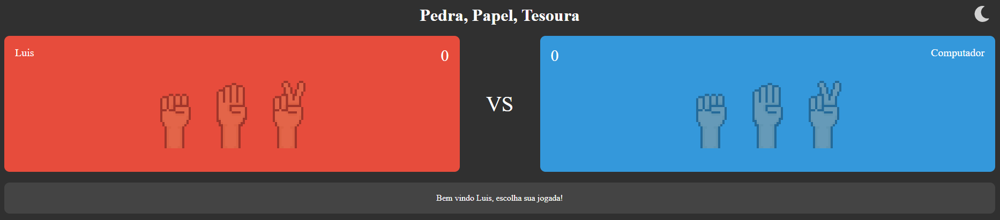
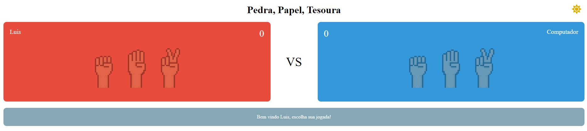
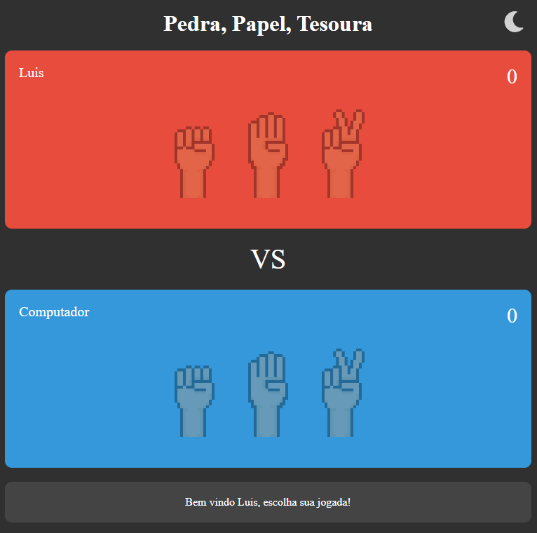

# Jogo pedra, papel, tesoura.

## Índice

- [Visão geral](#visão-geral)
  - [Desafio](#o-desafio)
  - [Screenshot](#screenshot)
  - [Links](#links)
- [Meu processo](#meu-processo)
  - [Feito com](#feito-com)
  - [O que eu aprendi](#o-que-eu-aprendi)
  - [Desenvolvimento contínuo](#desenvolvimento-contínuo)  
- [Autor](#autor)

## Visão geral

### O desafio

Os usuários devem ser capazes de:

- Veja o layout ideal para a página, dependendo do tamanho da tela do dispositivo.
- Recriar o jogo pedra, papel, tesoura.
- O jogo consiste em dois jogadores, um sendo o usuário e outro o computador, onde terá 3 opções de jogadas.
- Desafios do jogo:
    - Sortear a jogada do computador;
    - Verificar a jogada do usuário;
    - Verificar o ganhador;
    - Adicionar pontos ao ganhador;
    - Apresentar mensagem sobre o vencedor do jogo;
- A pagina também deve ser responsiva e ter dois temas (Claro e escuro)

### Screenshot

### Links

- Live Site URL: [https://luis-eduardo-drehmer.github.io/Pedra-Papel-Tesoura/]
## Meu processo

### Construção

- HTML5 semântico
- CSS desktop
- CSS Mobile
- JavaScript

### O que eu aprendi

1. HTML:
    - Reforcei meu conhecimento sobre html semântico  
2. JavaScript:
    - Aprendi a verificar, adicionar e remover classes dos elementos HTML;
    - Adicionar eventos aos elementos;
    - O uso do **forEach()** em uma lista;
    - Trabalhar com ***setTimeout()*** e com ***Math.randim()***

### Desenvolvimento contínuo

Para os próximos projetos quero focar em melhorar e aprofundar meu conhecimento em JavaScrits

## Autor

- Linkedin - [Luis Eduardo Drehmer](https://www.linkedin.com/in/luis-eduardo-drehmer-818303228/)
- Frontend Mentor - [@Luis-Eduardo-Drehmer](https://www.frontendmentor.io/profile/Luis-Eduardo-Drehmer)
- Instagram - [@luisdrehmer](https://www.instagram.com/luisdrehmer/)

